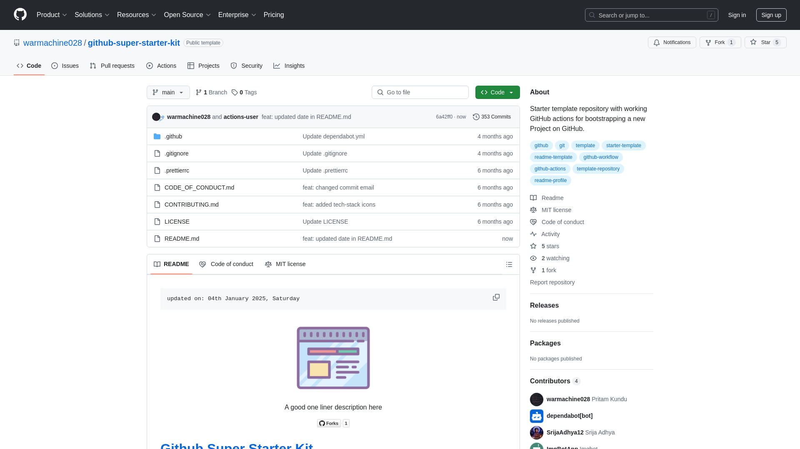

    updated on: 20th September 2024, Friday

    
    
 A good one liner description here 

    

# [Github Super Starter Kit](https://github.com/warmachine028/github-super-starter-kit)

![line]

## Table of Contents

- [Introduction](#introduction)
- [Getting Started](#getting-started)
- [Developement](#developement)
- [Tech Stack Used](#tech-stack-used)
- [Preview](#preview)
- [Best Contributors](#best-contributors)
- [License](#license)

![line]

## Introduction

- A github template to automate basic initial workflows of a project.

## Getting Started

### Generating a repo from the template

1. To configure automatic preview generation, replace [`url`](.github/take-snapshot.mjs#L5) with your hosted URL.
2. Configure the [CodeQL Analysis](.github/workflows/codeql-analysis.yml) according to your tech stack/language.
3. Configure [Dependabot](https://github.com/dependabot) alerts for package auto-updates and PRs for the package-manager of your choice inside [.github/dependabot.yml](.github/dependabot.yml)
4. Configure the directories and cron jobs of the package managers _(eg. client/server)_ inside [.github/dependabot.yml](.github/dependabot.yml).
5. By default **Dependabot Alerts** are enabled for npm only, the ones relevant to your project.
6. Feel free to add your own sections _(eg. Configuring, Designs, Documents, Diagrams)_ in this readme according to your requirements, make sure to link those sections in the above [**Table of Contents**](#table-of-contents)
7. You can find some free url-resourses below to find [markdown-badges], [icons] etc.

### Forking this template

- Run Initializer Action

1. Go to **Actions** tab
2. Enable workflows by Clicking on **green button** which says `I understand my workflows, go ahead and enable them`.
3. Click on `🍴 Fork initialize` from Actions Sidebar.
4. Click on `Run Workflow` in the **main** branch.
5. Go to **Security** tab

- Enable Dependabot Alerts

1. Wait for the Run Initializer above step to complete.
2. Go to [**Security**](https://github.com/warmachine028/github-super-starter-kit/security) tab.
3. Click on **Security Overview**.
4. Click on `Enable Dependabot alerts` button.

- Enable Code Scanning Alerts

1. Go to [Code security and analysis](https://github.com/SrijaAdhya12/github-super-starter-kit/settings/security_analysis#code_scanning_settings) section in settings.
2. Enable subsequent **Graphs**, **updates** and **alerts**.
3. Scroll down and go to **Tools** section set `CodeQL Analysis` to default.

![line]

## Developement

- Steps used for development of this project
- Build processes
- CI/CD commands
- Docker commands

![line]

## Tech Stack Used

- GitHub
- Markdown
- Prettier
- Dependabot
- GitHub Actions
- Yaml
- JavaScript

      

![line]

## Preview

<picture align="center">
    <source media="(prefers-color-scheme: light)" srcset=".github/preview-light.png">
    <source media="(prefers-color-scheme: dark)" srcset=".github/preview-dark.png">
    
</picture>

![line]

## Best Contributors

    

![line]

## License

- See [LICENSE]

**Pritam Kundu, 2024**

![line]

## Thank you, everyone 💚

[icons]: https://icons8.com
[markdown-badges]: https://github.com/Ileriayo/markdown-badges
[custom-icons]: https://simpleicons.org
[line]: https://user-images.githubusercontent.com/75939390/137615281-3a875960-92cc-407f-97fe-fd2319bdb252.png
[License]: https://github.com/warmachine028/github-super-starter-kit/blob/main/LICENSE

<!-- 20/09/24 -->
